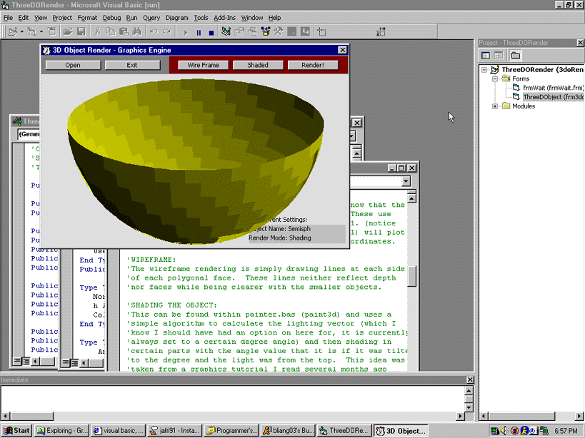



## Three\-D \(3d\) Object Render \(engine\)

### Description

Render 3D Objects using a inputted list of vertices and polygonal planes on a X, Y, Z environment. Originally an Object loader for a scrapped chess game. Render in wireframe or vector shading. It's not very well remarked, but I'm sure most of you will understand it. I hope you like it.
 
### More Info
 

             |
---                |---
**Submitted On**   |2000-05-24 19:36:56
**By**             |[Bradley Liang](https://github.com/Planet-Source-Code/PSCIndex/blob/master/ByAuthor/bradley-liang.md)
**Level**          |Advanced
**User Rating**    |4.8 (19 globes from 4 users)
**Compatibility**  |VB 5\.0, VB 6\.0
**Category**       |[Custom Controls/ Forms/  Menus](https://github.com/Planet-Source-Code/PSCIndex/blob/master/ByCategory/custom-controls-forms-menus__1-4.md)
**World**          |[Visual Basic](https://github.com/Planet-Source-Code/PSCIndex/blob/master/ByWorld/visual-basic.md)
**Archive File**   |[CODE\_UPLOAD61925282000\.zip](https://github.com/Planet-Source-Code/bradley-liang-three-d-3d-object-render-engine__1-8426/archive/master.zip)

